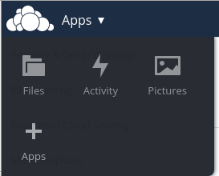
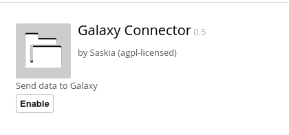
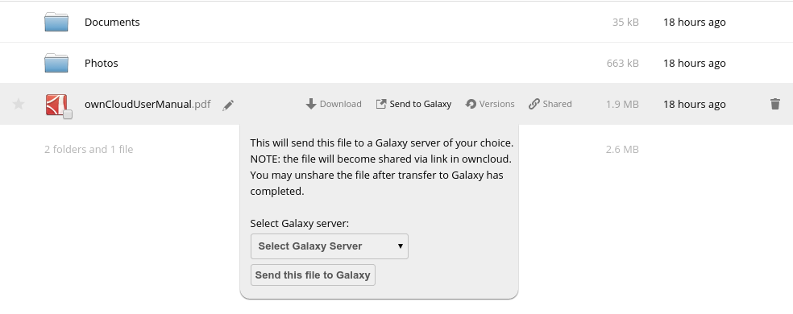

## Installation instructions

1. Copy the galaxyconnect folder to your owncloud apps directory (e.g. /var/www/owncloud/apps)

2. As an admin user, click on the Apps menu in top lefthand corner and select the "plus" symbol icon



3. Go to the "not enabled" section on lefthand menu, the galaxy connector app should appear in the list, click "enable" to enable the app




## Usage

Any files owned by or shared with a user will now get a "Send to Galaxy" option in their context menu



The users can now select from a list of Galaxy servers to send their file to.

Note that the owncloud file will become accessible via URL. This is necessary in order to enable the Galaxy server to fetch the file. 
Users may unshare the file again after file transfer has completed.


## Customising

The app lets users send data to a Galaxy server. The list of servers offered as options is configured in galaxyconnect/js/galaxyconnect.js

```
var GalaxyNames = ["Galaxian (Erasmus MC)", "CTMM TraIT Demo Galaxy", "Sandbox Galaxy"];
var GalaxyAddresses = ["http://bioinf-galaxian.erasmusmc.nl/galaxy/tool_runner","http://galaxy-demo.ctmm-trait.nl/tool_runner","http://galaxy-sandbox.trait-ctmm.cloudlet.nl/tool_runner"];
```

Edit these parameters as desired.


TODO: add the Galaxy server sent in the GALAXY_URL POST parameter in list for users starting from within Galaxy.
